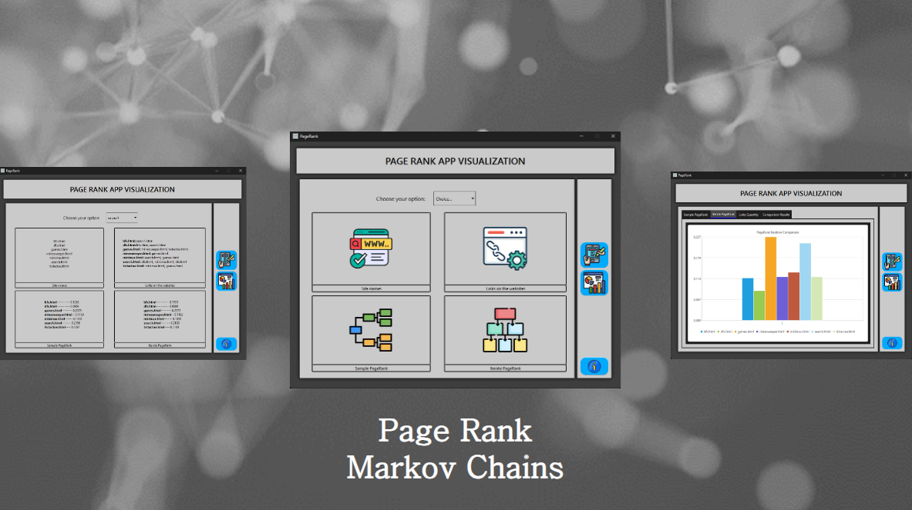

# PangeRank




Have you ever stopped to think about how many websites you visit per day? There are more than 1 billion websites scattered across the web. Imagine how difficult it would be to memorize the web addresses of every site you visit? And what about discovering new sites? To tackle these problems, web search engines like Google, Yahoo!, Bing, and others were created. But how do these search engines analyze all the websites and determine which ones should be more relevant to you? All of this is done through an algorithm called PageRank.

🚀 PageRank is an algorithm developed by Google with the purpose of ranking web pages based on their importance. It checks (in addition to internal page elements) the quantity and quality of links that the page has, helping to give greater relevance and certainty to search results.

---
## ⚙️ Usage
This is an gif example to you vizualizie the application:
<br><br>

Follow the steps to run the application on your local machine.


1. Clone the repository:
    ```
    git clone https://github.com/ODCS1/PageRank.git
    ```
5. Now, in the terminal, change the directory:
    ```
    cd PageRank/src
    ```
3. Make sure Python is installed:
    ```
    python --version
    ```
4. Install Dependencies:
    ```
    pip install pyside6
    ```
5. Run main.py:
    ```
    python main.py
    ```

<br>
<div align="center">
    </img>
</div>
<br><br>

## 🛠️ Contributors 


Made with [contrib.rocks](https://contrib.rocks).

---

⚡ Thank you for visiting my Repository! If you like what you saw, please star it and follow contributors to see more interesting projects coming soon.
